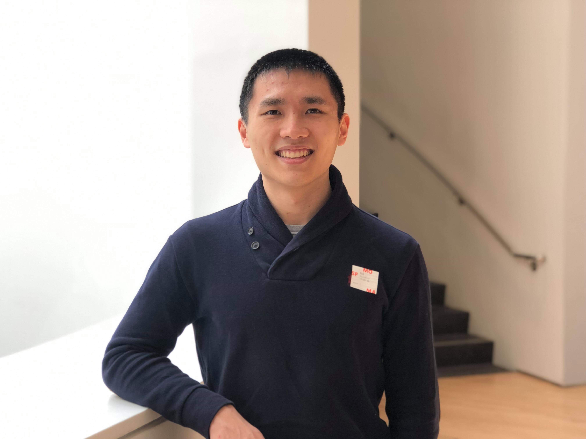

Hello! I am a first-year PhD student in the [Materials Science and Engineering](https://www.mse.berkeley.edu/){:target="_blank"} (MSE) department at the [University of California, Berkeley](https://www.berkeley.edu/){:target="_blank"}. I am advised by Prof. [Mark Asta](https://www.mse.berkeley.edu/ourfaculty/astam){:target="_blank"} and my research is broadly in the domain of **computational structural materials**.

Here is my <a href="enze-chen.github.io/files/resume_enze.pdf" target="_blank">resume</a> for a one-page summary. You can also find me on [GitHub](https://github.com/enze-chen){:target="_blank"} and [LinkedIn](https://www.linkedin.com/in/enzechen/){:target="_blank"}.

<b>
| &nbsp;[Research](#research-projects)&nbsp; | &nbsp;[Publications](#publications)&nbsp; | &nbsp;[Education](#education)&nbsp; | &nbsp;[Hobbies](#other-interests)&nbsp; | &nbsp;[Contact](#contact)&nbsp; |
</b>

## Research projects

### UC Berkeley
For my PhD, I am interested in using atomistic simulations to probe the mechanical behavior of alloys so that we can improve the efficacy of computational materials design. For my first project, I will be using a combination of density functional theory (DFT) calculations and machine learning (ML) to investigate the properties of Nickel-based alloys.

### Stanford University
Starting in summer 2016 and continuing until my graduation, I was an Undergraduate Research Assistant in the [Materials Theory and Computation Group](https://reedgroup.stanford.edu/index.html){:target="_blank"} at Stanford University. My mentors were [Qian Yang](http://www.qianyanglab.com/){:target="_blank"} (now Asst. Prof. at the [University of Connecticut](https://uconn.edu/){:target="_blank"}) and Prof. [Evan Reed](https://reedgroup.stanford.edu/staff/evanreed.html){:target="_blank"}. My research used [molecular dynamics](https://en.wikipedia.org/wiki/Molecular_dynamics){:target="_blank"} (MD) simulations and ML to study the chemical kinetics of hydrocarbon decomposition under extreme conditions. Specifically, I demonstrated that a ML model trained on isobutane (C4H10) decomposition could be used to accurately predict the reactions and species in methane (CH4) decomposition in mere minutes without the need to run another MD simulation that would take weeks. This work on chemical extrapolation has since been communicated at my oral presentation at [MRS Fall 2017 TC04.08.08](https://www.mrs.org/fall2017-symposium-sessions?Code=TC04){:target="_blank"}, in a [**first-author** publication](https://pubs.acs.org/doi/abs/10.1021/acs.jpca.8b09947){:target="_blank"} in [*The Journal of Physical Chemistry A*](https://pubs.acs.org/journal/jpcafh){:target="_blank"}, and in a [co-authored book chapter](https://link.springer.com/chapter/10.1007/978-3-030-05600-1_9){:target="_blank"} in [*Computational Approaches for Chemistry Under Extreme Conditions*](https://link.springer.com/book/10.1007%2F978-3-030-05600-1){:target="_blank"}.

### Sandia National Laboratories
During the summer of 2018, I was a R&D Intern at [Sandia National Laboratories](https://www.sandia.gov/){:target="_blank"} in Albuquerque, NM. I worked in the [Center for Computing Research](https://cfwebprod.sandia.gov/cfdocs/CompResearch/index.cfm){:target="_blank"} in the Multiscale Science Department (Org. 1444). My mentors were [John Mitchell](https://cfwebprod.sandia.gov/cfdocs/CompResearch/templates/insert/profile.cfm?jamitch){:target="_blank"} and [Jay Lofstead](https://cfwebprod.sandia.gov/cfdocs/CompResearch/templates/insert/profile.cfm?gflofst){:target="_blank"}, and I assisted in the development of a new I/O (Input/Output) system that drastically reduces the computational resource requirements of large-scale additive manufacturing simulations in [SPPARKS](https://spparks.sandia.gov/){:target="_blank"}. We are currently preparing a conference manuscript for submission to [*IPDPS 2020*](http://www.ipdps.org/){:target="_blank"}.

### Citrine Informatics
During the summer of 2017, I was a Data Science and Engineering intern at [Citrine Informatics](https://citrine.io){:target="_blank"}, a company headquartered in Redwood City, CA that specializes in using ML to accelerate materials science R&D. My mentors were Erin Antono, Jo Hill, and Dr. Bryce Meredig. I worked on three projects during this summer. The first was data engineering related and involved scraping and cleaning data to construct a dataset of polymer properties. The second was an internal data science research project on structural features for ML predictions of material properties. The third was in collaboration on a customer project that used ML to identify organic semiconducting materials with high mobility (presented at [MRS Spring 2019 GI01.07.02](https://www.mrs.org/spring2019/symposium-sessions/symposium-sessions-detail?code=GI01){:target="_blank"}).

### Washington University in St. Louis
My first exposure to the world of materials science came as a part of the [STARS](http://www.umsl.edu/~sep/STARS/index.html){:target="_blank"} summer program in 2012 in the [Soft Nanomaterials Laboratory](https://softnano.wustl.edu/){:target="_blank"} at [Washington University in St. Louis](https://wustl.edu/){:target="_blank"}. My mentors were [Limei Tian](https://engineering.tamu.edu/biomedical/profiles/tian-limei.html){:target="_blank"} (now Asst. Prof. at [Texas A&M University](https://www.tamu.edu/){:target="_blank"}) and Prof. [Srikanth Singamaneni](https://engineering.wustl.edu/Profiles/Pages/Srikanth-Singamaneni.aspx){:target="_blank"}. My research involved synthesizing gold nanorods and characterizing shifts in their localized surface plasmon resonance spectra based on their dimensions and changes in their local environment. This work has been communicated in a [co-authored publication](https://pubs.acs.org/doi/abs/10.1021/la3034534){:target="_blank"} in [*Langmuir*](https://pubs.acs.org/journal/langd5){:target="_blank"}.

 

## Publications
For an updated list of papers, conferences, and other work, please see my [Google Scholar page](https://scholar.google.com/citations?user=MMkofM4AAAAJ&hl=en){:target="_blank"}.

### Selected works

* **Enze Chen**, Qian Yang, Vincent Dufour-Décieux, Carlos A. Sing-Long, Rodrigo Freitas, Evan Reed. "Transferable Kinetic Monte Carlo Models with Thousands of Reactions Learned from Molecular Dynamics Simulation." [*Journal of Physical Chemistry A*](https://pubs.acs.org/doi/10.1021/acs.jpca.8b09947){:target="_blank"}, 123 (9), 2019. pp. 1874-1881.

* **Enze Chen**, Aaron Lindenberg. "MATSCI 142: Quantum Mechanics of Nanoscale Materials." Stanford University Coursereader. 2018. [GitHub](https://github.com/enze-chen/mse_142_cr){:target="_blank"}.

* **Enze Chen**, Qian Yang, Carlos Sing-Long, Evan Reed. "Chemically Transferable Kinetic Monte Carlo Models with Thousands of Reactions Learned from Molecular Dynamics Simulation of Hydrocarbon Chemistry." MRS Fall Meeting, Oral presentation, TC04.08.08, 2017.

 

## Education
After high school in the Midwest (St. Louis, MO), I have been fortunate enough to call the Bay Area home for the past five years and counting. Of course, you can imagine that [Big Game](https://en.wikipedia.org/wiki/Big_Game_(American_football)){:target="_blank"} is a tough test of loyalties.

| Degree | Program | Years | Institution |
| --- | --- | --- | --- |
| PhD student | [Materials Science and Engineering](https://www.mse.berkeley.edu/){:target="_blank"} | 2019-2023 (anticipated) | [UC Berkeley](https://www.berkeley.edu){:target="_blank"} |
| MS | [Computational and Mathematical Engineering](https://icme.stanford.edu/){:target="_blank"} | 2017-2018 | [Stanford University](https://www.stanford.edu){:target="_blank"} |
| BS with Distinction^, with Honors* | [Materials Science and Engineering](https://mse.stanford.edu){:target="_blank"} | 2014-2018 | [Stanford University](https://www.stanford.edu){:target="_blank"} |
| HS Diploma | | 2010-2014 | [Ladue HS](https://lhwhs.ladueschools.net/){:target="_blank"} |

^Top 15% of the graduating class based on cumulative GPA.  
\*Minimum GPA of 3.5 (3.965), Conference presentation (2017 MRS Fall), and Honors Thesis (**Title**: Transferable kinetic Monte Carlo models with thousands of reactions learned from molecular dynamics simulation of hydrocarbon chemistry).

 

## Other interests

### Education
In addition to MSE research, another passion of mine is education, particularly STEM curriculum design and learning theory. During my undergrad, I actively participated in the education community, taking classes through the [Stanford Graduate School of Education](https://ed.stanford.edu/){:target="_blank"} (GSE) with [Jo Boaler](https://ed.stanford.edu/faculty/joboaler){:target="_blank"} and [Jennifer Wolf](https://ed.stanford.edu/faculty/jlwolf){:target="_blank"}, participating in GSE workshops/seminars, and living in the [Education and Society Theme](http://web.stanford.edu/group/resed/cgi-bin/govco/east/){:target="_blank"} (EAST) House. I was also actively engaged in teaching opportunities through teaching with [Stanford Splash](https://github.com/enze-chen/splash_classes){:target="_blank"}, writing a [new coursereader](https://github.com/enze-chen/mse_142_cr){:target="_blank"} for the core undergraduate quantum mechanics class (MATSCI 142), and working as a TA for hundreds of students in Vadim Khayms's [undergraduate math classes](https://github.com/enze-chen/stanford_ta){:target="_blank"} (CME 100 and CME 104).

Professionally, I worked as the first Instructional Designer at [Citrine Informatics](https://citrine.io){:target="_blank"} prior to starting my PhD. I was in charge of designing educational content around machine learning, materials science, and our software platform for a wide variety of audiences, including data scientists, materials engineers, and business managers. In addition to developing a pedagogical framework for informatics education, I created many [**open-source** Jupyter notebooks](https://github.com/CitrineInformatics/learn-citrination) as instructional tools, and led a day-long workshop at the [Texas A&M Summer School on Computational Materials Science](https://cms3.tamu.edu/). I hope to continue exploring the field of education during my PhD and developing my skills for a future in academia, mentoring, and teaching.

### Social dance
I started social dancing two years ago and have fallen in love with it ever since. I learned the basic techniques of various waltzes (rotary, cross-step, Viennese, redowa), swing dances (4-count, 6-count, Lindy, west coast), Latin dances (tango, cha-cha, salsa), and miscellaneous (Night-club two step, hustle, polka, Schottische, Shim Sham, Tokyo Polka) from [Richard Powers](http://richardpowers.com/PowersCV.htm){:target="_blank"} in his social dance classes at Stanford. For the 2018-2019 school year, I was also a member of the [Viennese Ball Opening Committee](http://vienneseball.stanford.edu/){:target="_blank"}, where I performed a choreographed [waltz](https://www.youtube.com/watch?v=46LzArwG1w0){:target="_blank"} and [polka](https://www.youtube.com/watch?v=bhHvV_-1JbQ){:target="_blank"}. My favorite dances styles are probably cross-step waltz and west coast swing, but I am more than happy to lead/follow anything you're comfortable with. Hope to see you on the dance floor soon!

### Cooking
I love to cook! Most of my experience is with Chinese food---or at least made in that style---as that's what's made at home, but I do experiment with other cuisine from time to time. I'm currently forcing myself to learn how to bake and how to use an InstantPot, but these black-box, batch process methods are tough for someone who normally doesn't follow recipes (*dal cuore*, as my Italian teacher once said).

### Aquatic sports
I love being in the water, and have swam at various levels of competition for a little over a decade now. My high school coach also introduced me to water polo, and I've competed with [St. Louis Area Polo](http://www.leagueathletics.com/?org=stlouisareapolo){:target="_blank"} (SLAP) in high school and Stanford Club Water Polo in college. Nowadays, I mostly swim to stay fit and relax the mind, so if you would like some motivation to jump in a pool at 6:30AM, please let me know (because I do too)!

### Books, movies, and musicals
Finally, if I'm not doing one of the above activities, you will probably find me enjoying these forms of entertainment. I don't think my tastes for each medium are in and of themselves peculiar, but their combination might be. Always happy to take and prioritize any suggestions!

* **Books**: I love to read the genres of non-fiction, memoirs, and world literature (both fiction and non-fiction).
    * 5 most recent titles: [Hotel on the Corner of Bitter and Sweet](https://www.goodreads.com/book/show/3367956-hotel-on-the-corner-of-bitter-and-sweet){:target="_blank"}, [Tuesdays with Morrie](https://www.goodreads.com/book/show/6900.Tuesdays_with_Morrie){:target="_blank"}, [Educated](https://www.goodreads.com/book/show/35133922-educated){:target="_blank"}, [10% Happier](https://www.goodreads.com/book/show/18505796-10-happier){:target="_blank"}, [Becoming](https://www.goodreads.com/book/show/38746485-becoming){:target="_blank"}.
* **Movies**: I love to watch rom-coms (shameless), animated films (particularly anime, but also Disney/Dreamworks/etc), and documentaries. I've also only recently discovered indie films and want to view more in this genre.
    * 5 most recent titles: [One Child Nation](https://www.imdb.com/title/tt8923482/){:target="_blank"}, [The Big Easy](https://www.imdb.com/title/tt0092654/){:target="_blank"}, [Moonstruck](https://www.imdb.com/title/tt0093565){:target="_blank"}, [Dangal](https://www.imdb.com/title/tt5074352/){:target="_blank"}, [The Farewell](https://www.imdb.com/title/tt8637428/){:target="_blank"}.
* **Musicals**: I love musicals and showtunes! I've seen live and movie adaptations for about 30 so far, but who's counting?
    * 5 most recent titles: [My Fair Lady](https://en.wikipedia.org/wiki/My_Fair_Lady_(film)){:target="_blank"}, [Meet Me in St. Louis](https://en.wikipedia.org/wiki/Meet_Me_in_St._Louis){:target="_blank"}, [A Little Night Music](https://en.wikipedia.org/wiki/A_Little_Night_Music){:target="_blank"}, [La Cage aux Folles](https://en.wikipedia.org/wiki/La_Cage_aux_Folles_(musical)){:target="_blank"}, [Next to Normal](https://en.wikipedia.org/wiki/Next_to_Normal){:target="_blank"}.

  

## Contact
The best way to reach me is by email, at enze.chen1 [at] gmail.com.
 