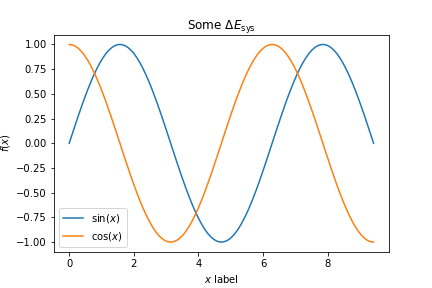
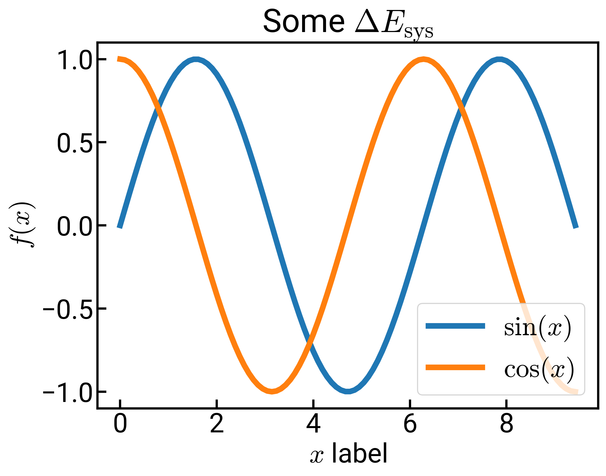

Those who know me well in a work capacity will know that I care a lot about quality figures. 
Like, ***a lot***.
I must admit up front that I am no graphic designer hot shot, but I understand the basics (e.g. vectorized graphics, color palettes, readable fonts) and try to do what I can with free software like [Python](https://www.python.org/){:target="_blank"} and [Inkscape](https://inkscape.org/){:target="_blank"}.
This blog post was inspired by me (somewhat accidentally) finally resolving a long-standing issue I had of mixing TeX with custom fonts in [Matplotlib](https://matplotlib.org/){:target="_blank"}, the plotting library in Python.
Here I'll document what I did and explain some of my reasoning behind the plot settings so you can judge for yourself if you want to copy these or not.
By writing this down, it also serves as a reference for myself when I make plots in the future.


### The default plot

Below is a relatively simple plot made with [default Matplotlib settings](https://matplotlib.org/3.3.3/users/dflt_style_changes.html){:target="_blank"} , with a code example below the figure.

<!-- <p></p> -->


```python
import numpy as np
import matplotlib.pyplot as plt
%matplotlib inline
x = np.linspace(0, 3*np.pi, 100)
y1 = np.sin(x)
y2 = np.cos(x)
fig, ax = plt.subplots()
ax.plot(x, y1, label='$\sin(x)$')
ax.plot(x, y2, label='$\cos(x)$')
ax.set_xlabel('$x$ label')
ax.set_ylabel('$f(x)$')
ax.set_title('Some $\Delta E_{\mathrm{sys}}$')
ax.legend()
plt.savefig('C:/Users/Enze/Desktop/mpl_default.png')
```

For all of the things I love about Matplotlib, here are most of the reasons that I dislike the default style.

* Everything is just **way too small** to be readable. Fonts need to be a lot bigger.
* Lines are also too thin and unappealing. To make our data really pop, the lines need to be thicker.
* It irks me that the ticks are pointing outwards. Yes, this way they don't cover your data, but I think they also unnecessarily bloat the borders of your image and actually *shrinks* the size of your data area.
* The default font of [DejaVu Sans](https://en.wikipedia.org/wiki/DejaVu_fonts){:target="_blank"}  is also not the most appealing, imo. [Roboto from Google](https://fonts.google.com/specimen/Roboto) is the way to go. If you're on Mac and like Helvetica, that's fine too. 
* In addition, the default mathfont has been changed from [Computer Modern](https://en.wikipedia.org/wiki/Computer_Modern){:target="_blank"} , the typeface we know and love from TeX, into DejaVu Sans, making the math text look just plain weird. I like to render math text in Computer Modern, but *keep everything else* in Roboto.
* The figure size is also really small and saved at too low of a resolution. It's hard to tell here since my website has a white background, but there's also a lot of padding around the edge of the figure (try viewing it in a new tab).

This calls for customization.


### Enter the rc parameters

One way we can do this customization is by toggling the settings in each individual command.
For example, for the *x*-axis label, I could've used `ax.set_xlabel('$x$ label', fontsize=20, fontname='Roboto')` to get what I wanted.
But right away we realize this would be really cumbersome to do for every single line *every single time* and would much rather prefer to have some global settings that we can easily copy+paste into each Python script or [Jupyter notebook](https://jupyter.org/){:target="_blank"}.

Luckily for us, Matplotlib uses a [**matplotlibrc** configuration file](https://matplotlib.org/3.2.1/tutorials/introductory/customizing.html#the-matplotlibrc-file){:target="_blank"}  to customize all kinds of properties.
`rc` is a legacy acronym for "run commands" which was (and still is) used for startup information/commands on Unix systems.
To see all of the settings that we can customize (stored as a dictionary), we can type `plt.rcParams` into a Jupyter notebook cell and see the (large!!) output that's printed.

Every time a figure is generated with Matplotlib, the default settings (that one can change) are read from here.
We have the ability to change these settings by adding the following line into our Python script.

```python
plt.rcParams.update({'key_1':new_value_1, 'key_2':new_value_2, ...})
```


### My default settings

I thought about sharing some of the difficulties I ran into when trying to optimize my default settings, but rather than confuse you with too many options (as I myself don't even understand it all), I'll just share the final settings I decided on.
The settings I updated are as follows:

```python
plt.rcParams.update({'figure.figsize':(8,6),       # Increase figure size
                     'font.size':24,               # Increase font size
                     'font.family':'sans-serif',   # Ensure default is sans-serif
                     'font.sans-serif':'Roboto',   # Roboto!
                     'mathtext.fontset':'cm',      # Change math font to Computer Modern
                     'mathtext.rm':'serif',        # Documentation recommended follow-up
                     'lines.linewidth':5,          # Thicker plot lines
                     'lines.markersize':12,        # Larger plot points
                     'axes.linewidth':2,           # Thicker axes lines (but not too thick)
                     'xtick.direction':'in',       # Change x-axis ticks to point in
                     'ytick.direction':'in',       # Ditto for y-axis ticks
                     'xtick.major.size':8,         # Make the x-ticks longer (our plot is larger!)
                     'xtick.major.width':2,        # Make the x-ticks wider
                     'ytick.major.size':8,         # Ditto for y-ticks
                     'ytick.major.width':2})       # Ditto for y-ticks
```

Now when I run the same code as above, but change the output line to

```python
plt.savefig('C:/Users/Enze/Desktop/mpl_updated.png', dpi=300, bbox_inches='tight')
```

I get a plot like the following:

<p></p>
<!--  -->

This should look a lot more refreshing.
Everything is bigger and we have the fonts we want.
I think it's particularly clean how in the title and *x*-axis label, we can have both regular text in Roboto and math text in Computer Modern.
The figure might look a little blurry due to HTML compression/rendering, but if you right-click and "Open image in new tab," you should see a huge upgrade in quality as our dots per inch has increased from 100 to 300.
300 is probably sufficient for most use cases and it's also the lower limit [required by *Nature*](https://www.nature.com/nature/for-authors/final-submission){:target="_blank"} and [*Science*](https://www.sciencemag.org/authors/instructions-preparing-revised-manuscript){:target="_blank"}.
You'll also notice when viewed in a new tab that the border is much tighter in the second image.

There are of course, a few more things that I do stylistically:

* The legend is overlapping with my figure, so in these cases I might [reposition it](https://matplotlib.org/3.2.1/api/_as_gen/matplotlib.pyplot.legend.html){:target="_blank"}  off to the side with `bbox_to_anchor`, or get rid of the legend and label the curves directly (either with [annotations](https://matplotlib.org/3.1.1/api/_as_gen/matplotlib.pyplot.annotate.html){:target="_blank"}  or in [Inkscape](https://inkscape.org/){:target="_blank"} ).
* I mentioned that I like vectorized graphics, so I would probably save the file as an [`SVG` file](https://en.wikipedia.org/wiki/Scalable_Vector_Graphics){:target="_blank"}  which is the default for Inkscape, or the more common `PDF` format. This is easily done by changing the extension (`.svg` or `.pdf`).
* You'll notice that sometimes our labels are too close to the figure (such as the title above). We can add either the `pad` (for titles) or `labelpad` (for axes labels) keyword into the individual commands to increase the spacing. I usually settle for somewhere around 10-15, e.g., `ax.set_xlabel('foo', labelpad=15)`.
* I actually think the default [color cycle](https://matplotlib.org/3.2.1/users/dflt_style_changes.html#colors-in-default-property-cycle){:target="_blank"}  and [colormap](https://matplotlib.org/3.2.1/users/dflt_style_changes.html#colormap){:target="_blank"}  are fine, but sometimes I like to [choose a different colormap](https://matplotlib.org/3.3.3/tutorials/colors/colormaps.html){:target="_blank"}  or even [define my own](https://matplotlib.org/3.3.3/tutorials/colors/colormap-manipulation.html){:target="_blank"} to emphasize a point. Have fun. :)
 
You will likely disagree with me on a lot of these settings, but hopefully you can use what I've laid out as a starting framework for your own customizations!