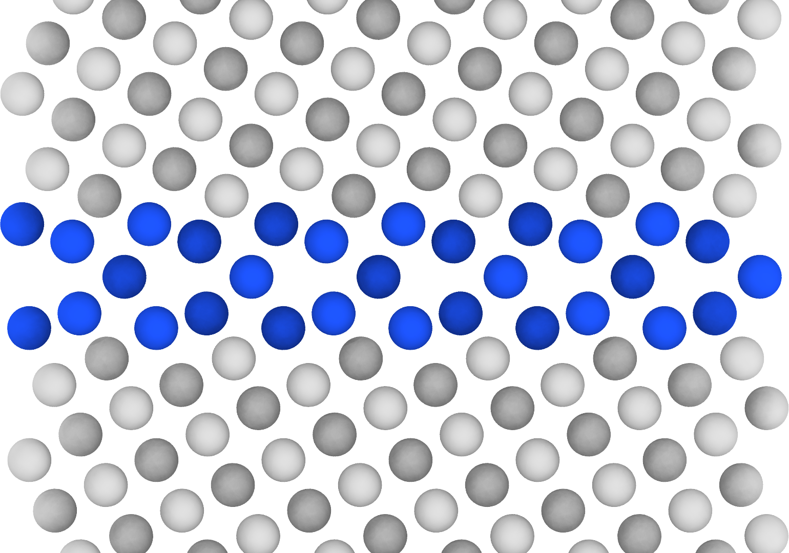

Those who know me well know that I care a lot about quality figures.
Like, ***a lot***.
Like, enough to even [create a new class](https://explorecourses.stanford.edu/search?q=matsci122){:target="_blank"} on it at Stanford.

Some of the earlier followers of my blog may recall a similar post I made about [Matplotlib](), the popular plotting library in Python.
While that post still remains a helpful reference for plotting data, it is less useful for another visualization task that is common in MSE: rendering atomic structures. 
This is something that I've had to do a lot in recent work, and it took me a couple different iterations to find a nice workflow.
So this blog post is meant to document my thoughts and provide a reference point for myself and others in a similar position.
I hope you find it helpful!


### Starting off: OVITO GUI 🖥️

Primarily in computational materials science and occasionally in experiments (e.g., crystallography), you'll end up with a file that contains a crystal structure with _xyz_ coordinates of the atom positions.
I am thinking of things like `CIF`, `POSCAR`, `LAMMPSDUMP`, etc.
And often for a publication/presentation or your own sanity, you want to visualize the structure in an informative and aesthetically pleasing way.

Perhaps the easiest way to do this is to use a program with a graphical user interface (GUI), examples of which include [VESTA](https://jp-minerals.org/vesta/en/download.html){:target="_blank"} and [OVITO](https://www.ovito.org/){:target="_blank"}.
And since my PhD was in computational metallurgy, I naturally got trained on OVITO, which has perfectly nice features and a fairly intuitive UI.
So now it was time to visualize some structures—grain boundaries, of course—and a common way to do this in our field is to make the atoms in the grain boundary (GB) core a different color to emphasize structural unit.
This means that I have to choose some colors, and recently I spent an entire day mixing and matching different combinations: I had to make sure the bulk crystal didn't stand out too much, and want the GB atoms to be distinct-but-not-alarming.
After much indecision, I went with a light gray (`#DADADA`) for the bulk atoms and a royal blue (`#1E55FF`) for the GB, shown below for the classic kite structure in a (210)[001] tilt GB in face-centered cubic Cu:

<span style="display:flex;justify-content:center">
	
</span>

Not bad! 
I can easily specify the camera position and figure resolution, resulting in a high-quality PNG export. 
Of course, having this as a baseline made me curious about a few things:
- This required a lot of careful tuning by hand. 
And if I had a lot of boundaries and I decided to change one small thing (like make the bulk atoms slightly darker), I would have to manually adjust each structure individually and rerun.
- The atoms have a nice 3D effect to them... but they also look like they're made of plastic.
I wonder if instead of "glossy" I can instead get a "matte" effect.

It turns out the OVITO GUI has the ability to use different [rendering engines](https://docs.ovito.org/usage/rendering.html){:target="_blank"}, but you have to pay for the Pro version to use anything other than the OpenGL default (or so I thought 😏).
At the time of writing, the Pro version is **$425/year** for a single-user academic license, which is way more than what I can afford! 😱


### Next step: ASE 👨🏼‍💻

Naturally, I wanted to see if there was a free option using open-source software.
The [Atomic Simulation Environment (ASE)](https://wiki.fysik.dtu.dk/ase/){:target="_blank"} is a popular Python package for interfacing with atomistic simulations, and they have [many visualization options](https://wiki.fysik.dtu.dk/ase/ase/visualize/visualize.html){:target="_blank"} with varying degrees of difficulty, with one of the simpler options being Matplotlib!
This got me excited and I tinkered around a bit to try and recreate the image of kites.
Note that in OVITO, the GB identification relied on the [common neighbor analysis](https://docs.ovito.org/reference/pipelines/modifiers/common_neighbor_analysis.html){:target="_blank"} (or you can use another structure identification scheme like [centrosymmetry parameter](https://docs.ovito.org/reference/pipelines/modifiers/centrosymmetry.html){:target="_blank"}), but for the purposes of demonstration I just hard-coded the coloring based on the atom positions.
The image is shown below and the code is [at the bottom](#ase-visualization) of the blog post.

<span style="display:flex;justify-content:center">
	
</span>

So now the 3D effect is completely gone, and hence the bulk atom colors are way too light, particularly against the glare of the computer screen.
While this is worse than the previous option, an upside of this is that I can save the figure as a _vectorized image_ (woohoo!), giving me the ability to edit it in Inkscape without any lossy compression.
It's also a programmable solution, so it is more scalable than clicking in a GUI.
With some fine tuning of the parameters, I can see this being useful in certain cases.
But I was still missing the final piece...


### The holy grail(?): OVITO Pro 👑

As some readers may be aware, it turns out that OVITO [also has a _free_ Python module](https://docs.ovito.org/python/introduction/introduction.html){:target="_blank"} that does everything one can do in the GUI with the Pro version.
It has a bit of a learning curve (though excellent documentation to assist), and I was historically fearful so I always came up with an excuse to not learn it.
To my great fortune, I recently got connected with the wonderful [Dr. Omar Hussein](https://www.linkedin.com/in/omarwan-hussein/){:target="_blank"}, who just published some [beautiful GB visuals](https://pubs.acs.org/doi/full/10.1021/acs.nanolett.4c02395){:target="_blank"} and kindly jumped on a Zoom call to teach me the ropes.
Thanks to his encouragement and guidance, I was finally motivated to learn OVITO Python and further improve my GB visualizations. 🙇🏼‍♂️

While learning any new code base can be daunting, I found it helpful to think of OVITO Python as having three sequential parts:
1. Creating a **pipeline** and adding modifiers (selection, common neighbor analysis, coloring, etc.), just like the "Modifications" section in the GUI.
	- As a computationalist, I actually found this part straightforward to do in the code, as it mirrored the GUI modifiers closely.
	- You can choose any of the [modifiers listed here](https://docs.ovito.org/python/modules/ovito_modifiers.html){:target="_blank"}, and refer to the documentation for all the parameters.
1. Configuring additional visual elements for the **data source** (particles, simulation cell, dislocations, etc.), again analogous to the "Visual elements" and "Data source" panels in the GUI.
	- This also mirrors the GUI, but some of the object attributes are a little unclear.
	The `dir()` function will be your friend. 😉
	- You may find the documentation for [visualization classes](https://docs.ovito.org/python/modules/ovito_vis.html){:target="_blank"} helpful.
1. Constructing a **viewport** and specifying the renderer.
The documentation is in the previous link.
	- To figure out the proper camera position and field of view (`fov`), a trick Omar shared with me is to first create a close-to-desired rendering in the GUI, click the view name in the top-left corner (like `Top` or `Front`), and then `Adjust View...`.
	This will show the values associated with the current view in the GUI, and using these as initial guesses for the Python code gets you pretty close! 🤞🏼

Some images are shown below and the code is [at the bottom](#ovito-pro-visualization) of the blog post.

<span style="display:flex;justify-content:center">
	 
	&nbsp;&nbsp;&nbsp;&nbsp;&nbsp;
	
</span>

Voilà!
With OVITO Pro, I had access to the [Tachyon](https://docs.ovito.org/reference/rendering/tachyon_renderer.html){:target="_blank"} ray tracing rendering engine, which produces high-quality visualizations with more realistic 3D effects like shadows and ambient occlusion shading. 
On the left in the above figure, the `ambient_occlusion` parameter is set to `True`, which produces subtle depth effects, evident by the different shades of gray in the bulk (different heights between (001) and (002) Cu atoms).
On the right in the above figure, the `ambient_occlusion` parameter is set to `False`, which produces uniform shading that is still superior to the default rendering engine.
I experimented with [OSPRay](https://docs.ovito.org/reference/rendering/ospray_renderer.html){:target="_blank"} as well and found it to work similarly.

At this point I felt like I had found a much better solution for rendering atomic structures, and learned a few things along the way.
You'll probably see some of these final renderings appear in future publications. 😜
Of course, this only scratches the surface of visualizations, as there are many other software that get the job done, possibly even better.
[Nglviewer](https://nglviewer.org/){:target="_blank"} and [Crystal Toolkit](https://docs.crystaltoolkit.org/){:target="_blank"} come to mind, and _the final boss_—[Blender](https://www.blender.org/){:target="_blank"}. 😎


### Appendix: Python code 🐍

The Cu (210) kite structure is a LAMMPS dump file that can be accessed [here](https://drive.google.com/file/d/1mCs2GFk7vNptI5fzu_ccV2-JPVs3r4Oy/view?usp=sharing){:target="_blank"}.
Installation of ASE should probably be [from `pip` following their instructions](https://wiki.fysik.dtu.dk/ase/install.html){:target="_blank"} and installation of OVITO should probably be [from `conda` following their instructions](https://docs.ovito.org/python/introduction/installation.html){:target="_blank"}.


#### ASE visualization

```python
import numpy as np 
import matplotlib.pyplot as plt
from ase.io.lammpsrun import read_lammps_dump
from ase.visualize.plot import plot_atoms 

# Import structure and finalize position
atoms = read_lammps_dump("Cu_210_kite.lammpsdump")
atoms *= (3, 2, 1)
atoms.positions += [0.4, 0, 0]
atoms.wrap()
zmid = 38.1581

# Create atom colors array
zp = atoms.positions[:, 2]
colors = np.array(['#DADADA' for _ in range(len(atoms))])
colors[(zp > zmid - 1.7) & (zp < zmid + 1.7)] = '#1E55FF'

# Create the plot and adjust settings
fig, ax = plt.subplots(figsize=(8,8))
h = plot_atoms(atoms=atoms, ax=ax, rotation=('90x,0y,0z'), show_unit_cell=0, \
               radii=2.0, scale=1.0, offset=(-0.5,0,0), colors=colors)
gb_thick = 7
dz = 3.28
ax.set_ylim(zmid - gb_thick - dz, zmid + gb_thick - dz)
ax.set_axis_off()
for p in h.patches:
    p.set_edgecolor('#53565A')
    p.set_linewidth(0.35)
plt.show()
fig.savefig("ase_kite.png", bbox_inches='tight', dpi=300)   # save as SVG for later editing!
```


#### OVITO Pro visualization

```python
# Step 0: Import modules and set constants
from ovito.io import import_file
from ovito.modifiers import CommonNeighborAnalysisModifier, ReplicateModifier, \
                            ExpressionSelectionModifier, AssignColorModifier, \
                            AffineTransformationModifier, WrapPeriodicImagesModifier
from ovito.vis import Viewport, ParticlesVis, TachyonRenderer

GRAY = (218/255, 218/255, 218/255)
BLUE = (30/255, 85/255, 255/255)

# Step 1: Import the file and set up the pipeline
infile = "Cu_210_kite.lammpsdump"
pipeline = import_file(infile, input_format='lammps/dump')
pipeline.modifiers.append(CommonNeighborAnalysisModifier(color_by_type=True))
pipeline.modifiers.append(ExpressionSelectionModifier(expression="StructureType==0"))
pipeline.modifiers.append(AssignColorModifier(color=BLUE))
pipeline.modifiers.append(ExpressionSelectionModifier(expression="StructureType!=0"))
pipeline.modifiers.append(AssignColorModifier(color=GRAY))
pipeline.modifiers.append(ReplicateModifier(num_x=3, num_y=2, num_z=1, adjust_box=True))
mod = AffineTransformationModifier(operate_on={'particles'}, 
                                   transformation=[[1, 0, 0, 0.4],
                                                   [0, 1, 0, 0  ],
                                                   [0, 0, 1, 0  ]])
pipeline.modifiers.append(mod)
pipeline.modifiers.append(WrapPeriodicImagesModifier())
pipeline.add_to_scene()

# Step 2: Get the data (atoms) and customize visual elements
data = pipeline.compute(0)
data.particles.vis.radius = 0.7
data.particles.vis.enabled = True
data.cell.vis.enabled = False

# Step 3: Set up the viewport and renderer settings
vp = Viewport(type=Viewport.Type.Front)
vp.camera_pos = (5.4, 6.65, 38.16)
vp.fov = 8.8
tachyon = TachyonRenderer(shadows=False, ambient_occlusion=True,
                          direct_light=True, direct_light_intensity=0.85)
vp.render_image(size=(1800, 1080), filename="ovito_vis.png", background=(1,1,1), 
                alpha=False, renderer=tachyon, crop=True)
pipeline.remove_from_scene()
```

